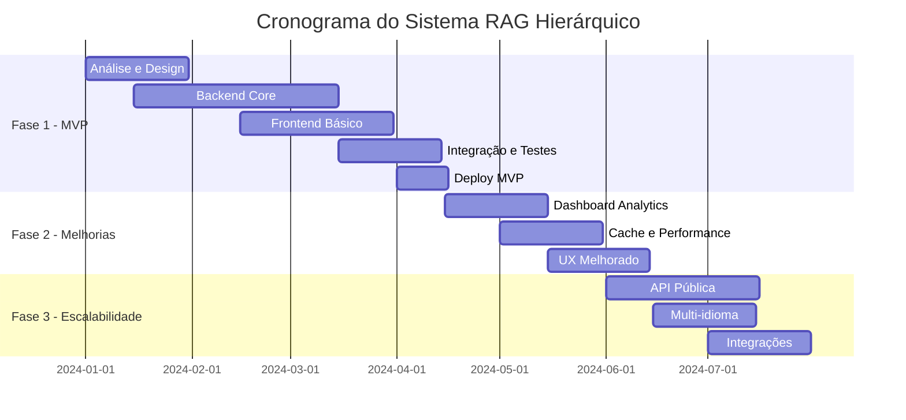

# Product Requirements Document (PRD)
## Sistema RAG Hierárquico para Gestão de Conhecimento

---

## 1. Visão Geral do Produto

### 1.1 Propósito
O Sistema RAG Hierárquico é uma plataforma de gestão e recuperação inteligente de conhecimento que permite às organizações indexar, organizar e pesquisar grandes volumes de documentos técnicos de forma eficiente e contextualizada.

### 1.2 Problema a Resolver
- **Sobrecarga de Informação**: Organizações possuem vastos repositórios de documentos dispersos e difíceis de navegar
- **Busca Ineficiente**: Ferramentas tradicionais de busca não compreendem contexto e semântica
- **Conhecimento Fragmentado**: Dificuldade em encontrar informações relacionadas em diferentes documentos
- **Perda de Produtividade**: Tempo excessivo gasto procurando informações específicas

### 1.3 Valor Proposicional
- **Busca Inteligente**: Combina pesquisa semântica e textual para resultados mais precisos
- **Organização Hierárquica**: Estrutura natural que facilita navegação top-down
- **Escalabilidade**: Suporta grandes volumes de documentos sem perda de performance
- **Flexibilidade**: Adaptável a diferentes tipos de conhecimento e organizações

---

## 2. Objetivos e Métricas de Sucesso

### 2.1 Objetivos de Negócio
| Objetivo | Métrica | Meta |
|----------|---------|------|
| Reduzir tempo de busca | Tempo médio para encontrar informação relevante | 70% de redução |
| Aumentar precisão | Taxa de resultados relevantes nos top 5 | >85% |
| Melhorar adoção | Usuários ativos mensais | 90% dos usuários potenciais |
| Reduzir duplicação | Reuso de conhecimento existente | +40% |

### 2.2 Métricas Técnicas
- **Performance de Busca**: <2 segundos para qualquer consulta
- **Disponibilidade**: 99.9% uptime
- **Capacidade**: Suporte a 10M+ documentos
- **Precisão da Busca**: >80% relevância nos primeiros 10 resultados

---

## 3. Personas e Casos de Uso

### 3.1 Personas Primárias

#### 3.1.1 Pesquisador/Analista
- **Perfil**: Profissional que precisa encontrar informações específicas rapidamente
- **Necessidades**: 
  - Busca precisa e contextual
  - Acesso a documentos relacionados
  - Histórico de pesquisas
- **Frustrações**: Resultados irrelevantes, tempo perdido navegando

#### 3.1.2 Gestor de Conhecimento
- **Perfil**: Responsável por organizar e manter bases de conhecimento
- **Necessidades**:
  - Ferramentas de administração
  - Métricas de uso
  - Controle de versões
- **Frustrações**: Dificuldade em manter conteúdo atualizado e organizado

#### 3.1.3 Administrador de Sistema
- **Perfil**: Responsável pela infraestrutura e performance do sistema
- **Necessidades**:
  - Monitoramento e alertas
  - Configuração de parâmetros
  - Gestão de usuários
- **Frustrações**: Sistemas complexos e difíceis de manter

### 3.2 Casos de Uso Principais

#### 3.2.1 UC001 - Pesquisa Inteligente de Documentos
**Ator**: Pesquisador
**Objetivo**: Encontrar informações específicas em grande volume de documentos
**Fluxo Principal**:
1. Usuário insere termo de busca
2. Sistema executa pesquisa híbrida (semântica + textual)
3. Sistema apresenta resultados ranqueados por relevância
4. Usuário navega pelos resultados hierarquicamente
5. Sistema apresenta contexto completo do documento

**Critérios de Aceitação**:
- Resultados em <2 segundos
- Top 5 resultados com >85% de relevância
- Interface permite navegação hierárquica

#### 3.2.2 UC002 - Gestão de Bibliotecas de Conhecimento
**Ator**: Gestor de Conhecimento
**Objetivo**: Organizar documentos em bibliotecas temáticas
**Fluxo Principal**:
1. Gestor cria nova biblioteca com área de conhecimento
2. Define pesos de pesquisa (semântica vs textual)
3. Adiciona documentos à biblioteca
4. Sistema processa automaticamente documentos em background
5. Gestor monitora status do processamento

**Critérios de Aceitação**:
- Interface intuitiva para criação de bibliotecas
- Processamento automático de documentos
- Feedback visual do progresso

#### 3.2.3 UC003 - Versionamento de Documentos
**Ator**: Gestor de Conhecimento
**Objetivo**: Manter histórico e controlar versões de documentos
**Fluxo Principal**:
1. Gestor faz upload de nova versão de documento existente
2. Sistema marca versão anterior como não vigente
3. Sistema mantém histórico de todas as versões
4. Pesquisas podem optar por incluir versões históricas
5. Sistema permite comparação entre versões

**Critérios de Aceitação**:
- Controle automático de versões
- Opção de pesquisar em versões históricas
- Interface para comparação de versões

---

## 4. Funcionalidades e Requisitos

### 4.1 Funcionalidades Core (MVP)

#### 4.1.1 Gestão de Bibliotecas
**Prioridade**: Crítica
**Descrição**: Permite criar e gerenciar coleções temáticas de documentos

**Funcionalidades Detalhadas**:
- Criar biblioteca com nome e área de conhecimento
- Configurar pesos de pesquisa (semântica vs textual)
- Adicionar metadados customizados
- Editar e excluir bibliotecas
- Listar todas as bibliotecas

**Regras de Negócio**:
- Nome da biblioteca deve ser único dentro da organização
- Soma dos pesos semântico e textual deve ser igual a 1.0
- Exclusão de biblioteca requer confirmação (operação irreversível)

#### 4.1.2 Gestão de Documentos
**Prioridade**: Crítica
**Descrição**: Upload, processamento e versionamento de documentos

**Funcionalidades Detalhadas**:
- Upload de documentos em formato Markdown
- Processamento automático em background
- Controle de versões automático
- Adição de metadados (autor, data, palavras-chave)
- Visualização de status de processamento

**Regras de Negócio**:
- Apenas um documento pode estar vigente por título
- Documentos devem ter ao menos 100 caracteres
- Processamento deve ser assíncrono para não bloquear interface
- Metadados obrigatórios: título, data de publicação

#### 4.1.3 Pesquisa Híbrida
**Prioridade**: Crítica
**Descrição**: Motor de busca que combina pesquisa semântica e textual

**Funcionalidades Detalhadas**:
- Busca por termo livre
- Filtro por biblioteca específica
- Opção de incluir documentos não vigentes
- Configuração de limite de resultados
- Personalização de pesos semântico/textual por consulta

**Regras de Negócio**:
- Busca deve retornar resultados em <2 segundos
- Resultados ordenados por score de relevância
- Máximo de 100 resultados por consulta
- Destacar termos de busca nos resultados

#### 4.1.4 Navegação Hierárquica
**Prioridade**: Crítica
**Descrição**: Interface para navegar documentos em estrutura hierárquica

**Funcionalidades Detalhadas**:
- Visualização de biblioteca → documento → capítulo → trecho
- Breadcrumb para mostrar localização atual
- Links entre seções relacionadas
- Prévia de conteúdo em cada nível

**Regras de Negócio**:
- Navegação deve preservar contexto da busca original
- Interface responsiva para diferentes dispositivos
- Carregamento lazy de conteúdo para performance

### 4.2 Funcionalidades Avançadas (Pós-MVP)

#### 4.2.1 Dashboard Analítico
**Prioridade**: Média
**Descrição**: Métricas e insights sobre uso do sistema

**Funcionalidades**:
- Estatísticas de uso por biblioteca
- Termos mais pesquisados
- Performance das consultas
- Relatórios de adoção

#### 4.2.2 Cache Inteligente
**Prioridade**: Média
**Descrição**: Sistema de cache para otimizar performance

**Funcionalidades**:
- Cache de resultados frequentes
- Invalidação inteligente baseada em atualizações
- Métricas de hit rate do cache

#### 4.2.3 API Pública
**Prioridade**: Baixa
**Descrição**: APIs para integração com sistemas externos

**Funcionalidades**:
- Endpoints REST documentados
- Autenticação via API key
- Rate limiting
- SDK para linguagens populares

---

## 5. Experiência do Usuário (UX)

### 5.1 Jornada do Usuário Principal

#### 5.1.1 Primeira Utilização
1. **Onboarding**: Tutorial interativo explicando conceitos básicos
2. **Exploração**: Interface guiada para primeira pesquisa
3. **Descoberta**: Apresentação dos resultados hierárquicos
4. **Navegação**: Exploração aprofundada de documentos

#### 5.1.2 Uso Cotidiano
1. **Acesso Rápido**: Barra de pesquisa prominente na interface
2. **Busca Eficiente**: Autocomplete e sugestões de termos
3. **Resultados Contextuais**: Apresentação clara da hierarquia
4. **Navegação Fluida**: Transição suave entre níveis

### 5.2 Princípios de Design

#### 5.2.1 Simplicidade
- Interface limpa e minimalista
- Foco na funcionalidade principal (busca)
- Redução de cliques necessários

#### 5.2.2 Clareza
- Hierarquia visual clara
- Feedback imediato de ações
- Estados de carregamento informativos

#### 5.2.3 Eficiência
- Atalhos de teclado para usuários avançados
- Busca instantânea conforme digitação
- Histórico de pesquisas recentes

### 5.3 Wireframes Conceituais

#### 5.3.1 Tela Principal de Busca
```
┌─────────────────────────────────────────────────────┐
│ LOGO           [Pesquisar...] 🔍     👤 Admin       │
├─────────────────────────────────────────────────────┤
│                                                     │
│     🔍 Sistema RAG Hierárquico                      │
│                                                     │
│  ┌─────────────────────────────────────────────┐    │
│  │ Digite sua consulta aqui...               🔍│    │
│  └─────────────────────────────────────────────┘    │
│                                                     │
│  📚 Bibliotecas Disponíveis:                       │
│  ○ Engenharia de Software (1,234 docs)              │
│  ○ Medicina (856 docs)                              │
│  ○ Direito (2,103 docs)                             │
│                                                     │
│  🕐 Pesquisas Recentes:                             │
│  • clean architecture                               │
│  • microservices patterns                           │
│                                                     │
└─────────────────────────────────────────────────────┘
```

#### 5.3.2 Tela de Resultados
```
┌─────────────────────────────────────────────────────┐
│ [← Voltar] Resultados para: "clean code"    🔧⚙️    │
├─────────────────────────────────────────────────────┤
│ 📊 15 resultados encontrados em 1.2s               │
│                                                     │
│ ┌─[95% relevância]─────────────────────────────────┐│
│ │ 📚 Engenharia de Software                        ││
│ │ 📖 Clean Code: A Handbook... - Robert Martin     ││
│ │ 📄 Capítulo 2: Nomes Significativos             ││
│ │ "Escolher bons nomes leva tempo, mas..."         ││
│ │ [Ver Contexto Completo] [Documento Original]     ││
│ └─────────────────────────────────────────────────┘│
│                                                     │
│ ┌─[87% relevância]─────────────────────────────────┐│
│ │ 📚 Engenharia de Software                        ││
│ │ 📖 Clean Architecture - Robert Martin            ││
│ │ 📄 Capítulo 1: O que é Design?                  ││
│ │ "O objetivo da arquitetura é minimizar..."       ││
│ │ [Ver Contexto Completo] [Documento Original]     ││
│ └─────────────────────────────────────────────────┘│
│                                                     │
└─────────────────────────────────────────────────────┘
```

---

## 6. Requisitos Técnicos

### 6.1 Arquitetura e Performance

#### 6.1.1 Escalabilidade
- **Documentos**: Suporte a 10M+ documentos
- **Usuários Concorrentes**: 1,000+ usuários simultâneos
- **Throughput**: 100+ consultas por segundo
- **Armazenamento**: Crescimento horizontal de dados

#### 6.1.2 Performance
- **Tempo de Resposta**: <2s para 95% das consultas
- **Disponibilidade**: 99.9% uptime (8.76h downtime/ano)
- **Processamento**: Documentos processados em <1 hora
- **Indexação**: Novos embeddings em <10 minutos

#### 6.1.3 Segurança
- **Autenticação**: Integração com SSO corporativo
- **Autorização**: Controle de acesso baseado em roles
- **Dados**: Criptografia em trânsito e em repouso
- **Auditoria**: Log de todas as operações sensíveis

### 6.2 Integração e Compatibilidade

#### 6.2.1 Formatos Suportados
- **Entrada**: Markdown, PDF (conversão automática)
- **Metadados**: JSON flexível
- **Export**: JSON, CSV para relatórios

#### 6.2.2 APIs e Protocolos
- **REST API**: OpenAPI 3.0 compliant
- **Webhooks**: Notificações de eventos
- **Streaming**: Server-sent events para updates em tempo real

### 6.3 Infraestrutura

#### 6.3.1 Banco de Dados
- **Principal**: PostgreSQL 18+ com PGVector
- **Cache**: Redis para sessões e cache de resultados
- **Backup**: Backup automático diário com retenção de 30 dias

#### 6.3.2 Deployment
- **Containerização**: Docker containers
- **Orquestração**: Kubernetes para produção
- **CI/CD**: Pipeline automatizado com testes

---

## 7. Restrições e Limitações

### 7.1 Limitações Técnicas
- **Tamanho de Documento**: Máximo 50MB por documento
- **Formatos**: Apenas texto e Markdown no MVP
- **Idiomas**: Suporte inicial apenas para português
- **Modelos de IA**: Dependente de APIs externas (OpenAI)

### 7.2 Restrições de Negócio
- **Orçamento**: Limitado para fase MVP
- **Timeline**: 6 meses para primeira versão
- **Equipe**: 3 desenvolvedores + 1 UX + 1 DevOps
- **Compliance**: Deve atender LGPD/GDPR

### 7.3 Dependências Externas
- **OpenAI API**: Para geração de embeddings
- **PostgreSQL**: Versão mínima 15 com extensão vector
- **Cloud Provider**: AWS ou equivalente
- **SSO Provider**: Para autenticação corporativa

---

## 8. Cronograma e Marcos

### 8.1 Roadmap de Alto Nível



### 8.2 Marcos Críticos

| Marco | Data | Deliverables | Critério de Sucesso |
|-------|------|--------------|-------------------|
| **M1 - Architecture Complete** | 2024-01-30 | Especificação técnica, protótipos | Aprovação técnica da arquitetura |
| **M2 - Backend MVP** | 2024-03-15 | APIs funcionais, banco configurado | Testes automatizados passando |
| **M3 - Frontend MVP** | 2024-04-01 | Interface básica funcional | Cenários principais navegáveis |
| **M4 - MVP Launch** | 2024-04-15 | Sistema em produção | 10 usuários piloto utilizando |
| **M5 - Production Ready** | 2024-06-01 | Sistema otimizado | SLA de performance atingido |

---

## 9. Critérios de Aceitação e Definição de Pronto

### 9.1 Critérios Globais de Aceitação

#### 9.1.1 Funcionalidade
- [ ] Todas as funcionalidades core implementadas
- [ ] Casos de uso principais funcionando end-to-end
- [ ] Performance dentro dos SLAs definidos
- [ ] Tratamento adequado de erros

#### 9.1.2 Qualidade
- [ ] Cobertura de testes >80%
- [ ] Testes de integração passando
- [ ] Code review aprovado
- [ ] Documentação técnica completa

#### 9.1.3 UX/UI
- [ ] Interface responsiva em desktop e mobile
- [ ] Acessibilidade WCAG 2.1 AA
- [ ] Testes de usabilidade validados
- [ ] Performance de frontend <3s carregamento

### 9.2 Definition of Done por Feature

#### 9.2.1 Checklist Técnico
- [ ] Código implementado conforme especificação
- [ ] Testes unitários escritos e passando
- [ ] Testes de integração funcionando
- [ ] Code review por pelo menos 2 pessoas
- [ ] Documentação da API atualizada
- [ ] Logs e métricas implementados

#### 9.2.2 Checklist de Produto
- [ ] Funcionalidade testada pelo Product Owner
- [ ] Critérios de aceitação validados
- [ ] UX review aprovado
- [ ] Testes de usabilidade realizados
- [ ] Performance validada em ambiente similar à produção

---

## 10. Riscos e Mitigações

### 10.1 Riscos Técnicos

| Risco | Probabilidade | Impacto | Mitigação |
|-------|---------------|---------|-----------|
| **Performance de busca degradada** | Média | Alto | Implementar cache agressivo, otimizar queries, monitoramento proativo |
| **Dependência de APIs externas** | Alta | Médio | Implementar fallbacks, cache de embeddings, SLA com fornecedores |
| **Complexidade do PGVector** | Baixa | Alto | POC antecipado, expertise externa, plano B com Elasticsearch |
| **Escalabilidade do processamento** | Média | Médio | Arquitetura async desde início, queue de processamento |

### 10.2 Riscos de Produto

| Risco | Probabilidade | Impacto | Mitigação |
|-------|---------------|---------|-----------|
| **Baixa adoção pelos usuários** | Média | Alto | Testes de usabilidade frequentes, onboarding eficaz, feedback loops |
| **Relevância dos resultados insatisfatória** | Alta | Alto | Fine-tuning contínuo, feedback de usuários, A/B testing |
| **Competição com soluções existentes** | Alta | Médio | Foco no diferencial hierárquico, integração profunda |

### 10.3 Riscos de Negócio

| Risco | Probabilidade | Impacto | Mitigação |
|-------|---------------|---------|-----------|
| **Mudança de prioridades organizacionais** | Baixa | Alto | Comunicação constante com stakeholders, ROI claro |
| **Restrições orçamentárias** | Média | Médio | MVP enxuto, iterações incrementais, business case sólido |
| **Compliance e regulamentações** | Baixa | Alto | Consultoria jurídica, privacy by design, auditoria de segurança |

---

## 11. Suporte e Manutenção

### 11.1 Modelo de Suporte

#### 11.1.1 Níveis de Suporte
- **L1 - Help Desk**: Questões básicas de uso, primeiros atendimentos
- **L2 - Técnico**: Problemas de configuração, bugs menores
- **L3 - Desenvolvimento**: Bugs complexos, novas funcionalidades

#### 11.1.2 SLAs de Suporte
| Prioridade | Tempo de Resposta | Tempo de Resolução |
|------------|------------------|-------------------|
| **Crítico** | 1 hora | 4 horas |
| **Alto** | 4 horas | 24 horas |
| **Médio** | 8 horas | 72 horas |
| **Baixo** | 24 horas | 1 semana |

### 11.2 Manutenção Preventiva

#### 11.2.1 Rotinas Automáticas
- Backup diário dos dados
- Limpeza de logs antigos
- Otimização de índices
- Monitoramento de performance

#### 11.2.2 Atualizações Planejadas
- Atualizações de segurança mensais
- Funcionalidades trimestrais
- Otimizações de performance semestrais
- Upgrade de infraestrutura anual

---

## 12. Glossário

| Termo | Definição |
|-------|-----------|
| **Embedding** | Representação vetorial de texto que captura semântica |
| **RAG** | Retrieval-Augmented Generation - técnica que combina busca e geração |
| **PGVector** | Extensão do PostgreSQL para operações com vetores |
| **Pesquisa Híbrida** | Combinação de busca semântica (vetores) e textual (keywords) |
| **Chunk/Trecho** | Fragmento de documento processado para indexação |
| **Top-down** | Abordagem de busca que vai do geral para o específico |
| **Flag Vigente** | Indicador de qual versão do documento está ativa |
| **Biblioteca** | Coleção temática de documentos relacionados |
| **Score de Relevância** | Pontuação que indica quão relevante é um resultado |
| **Tokenização** | Processo de divisão de texto em unidades menores |

---

## 13. Anexos

### 13.1 Referências Técnicas
- [PostgreSQL PGVector Documentation](https://github.com/pgvector/pgvector)
- [OpenAI Embeddings API](https://platform.openai.com/docs/guides/embeddings)
- [Spring Boot Best Practices](https://spring.io/projects/spring-boot)
- [RAG Implementation Patterns](https://arxiv.org/abs/2005.11401)

### 13.2 Estudos de Mercado
- Análise de concorrentes: Elasticsearch, Solr, Pinecone
- Benchmark de performance de sistemas similares
- Pesquisa de satisfação com soluções atuais

### 13.3 Decisões Arquiteturais (ADRs)
- ADR-001: Escolha do PostgreSQL com PGVector vs. Elasticsearch
- ADR-002: Arquitetura hierárquica vs. flat indexing
- ADR-003: Processamento síncrono vs. assíncrono
- ADR-004: Estratégia de cache Redis vs. cache aplicativo

---

**Documento aprovado por:**
- Product Owner: [Nome]
- Tech Lead: [Nome]  
- UX Lead: [Nome]
- Stakeholder: [Nome]

**Versão**: 1.0  
**Data**: 2024-01-15  
**Próxima Revisão**: 2024-02-15